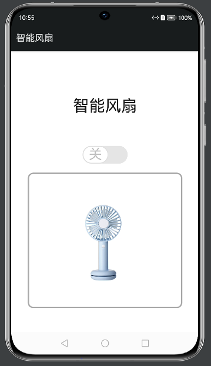

# 基于Hi3861的鸿蒙智能风扇控制APP

本仓库为鸿蒙技术开发与应用课程作业，共包含两个文件夹。

* Harmony_Smart_Fan

该文件夹为APP前端相应代码，使用HarmonyOS SDK API 7的JS开发。

* Hi3861_APP

该文件夹为Hi3861开发板对应代码。将其置于该开发板源码的./applications/sample/wifi-iot/app文件夹中。

## APP前端示意图

